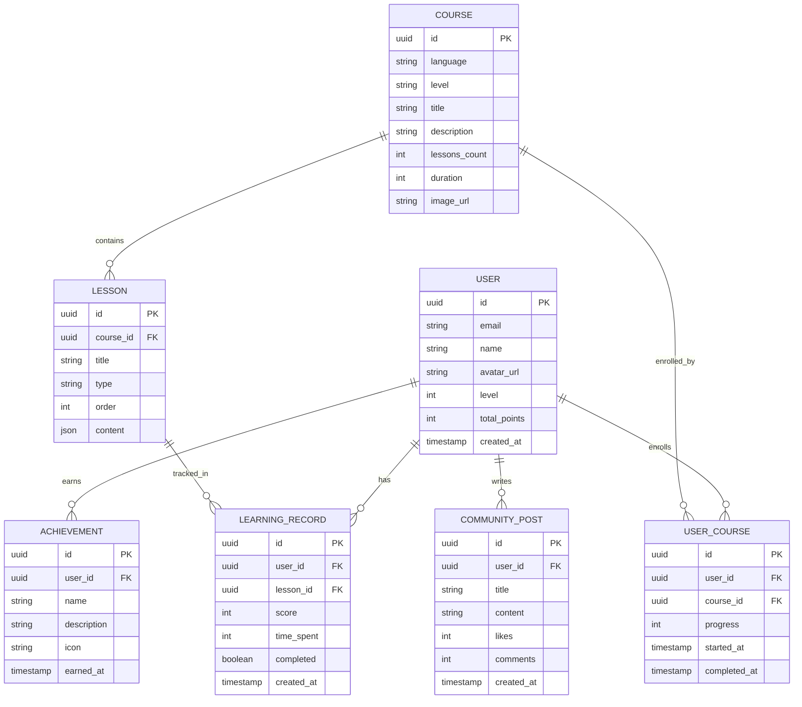

## 1. 架构设计

```mermaid
graph TB
    subgraph Frontend[前端层]
        React[React 18]
        Router[React Router]
        State[Zustand 状态管理]
        Tailwind[Tailwind CSS]
    end
    
    subgraph Backend[后端层]
        Express[Express.js]
        Auth[认证服务]
        API[API 路由]
    end
    
    subgraph Database[数据层]
        Supabase[(Supabase PostgreSQL)]
        Storage[对象存储]
    end
    
    React --&gt; Router
    React --&gt; State
    React --&gt; Tailwind
    React --&gt; API
    API --&gt; Express
    Express --&gt; Auth
    Auth --&gt; Supabase
    Express --&gt; Supabase
    Express --&gt; Storage
```

## 2. 技术栈

- **前端**：React 18 + TypeScript + Tailwind CSS 3 + Vite
- **路由**：React Router DOM
- **状态管理**：Zustand
- **图标**：Lucide React
- **后端**：Express.js 4 + TypeScript
- **数据库和认证**：Supabase (PostgreSQL + Auth)
- **初始化工具**：vite-init

## 3. 路由定义

| 路由路径 | 页面组件 | 功能描述 |
|----------|----------|----------|
| / | Dashboard | 首页/仪表盘 |
| /login | Login | 登录页面 |
| /register | Register | 注册页面 |
| /courses | Courses | 课程中心 |
| /courses/:id | CourseDetail | 课程详情 |
| /vocabulary | Vocabulary | 单词记忆 |
| /grammar | Grammar | 语法练习 |
| /listening | Listening | 听力训练 |
| /speaking | Speaking | 口语跟读 |
| /progress | Progress | 学习进度 |
| /community | Community | 社区交流 |
| /profile | Profile | 用户中心 |

## 4. API 定义

### 4.1 认证接口
```typescript
// POST /api/auth/login
interface LoginRequest {
  email: string;
  password: string;
}

interface LoginResponse {
  token: string;
  user: User;
}

// POST /api/auth/register
interface RegisterRequest {
  email: string;
  password: string;
  name: string;
}

interface RegisterResponse {
  token: string;
  user: User;
}
```

### 4.2 学习数据接口
```typescript
// GET /api/progress
interface ProgressResponse {
  totalDays: number;
  streak: number;
  todayMinutes: number;
  wordsLearned: number;
  coursesCompleted: number;
  achievements: Achievement[];
}

// GET /api/courses
interface CoursesResponse {
  courses: Course[];
}

// POST /api/learning/complete
interface CompleteLessonRequest {
  lessonId: string;
  score: number;
  timeSpent: number;
}
```

## 5. 数据模型

### 5.1 ER 图



### 5.2 数据库表定义

```sql
-- 用户表
CREATE TABLE users (
    id UUID PRIMARY KEY DEFAULT gen_random_uuid(),
    email TEXT UNIQUE NOT NULL,
    name TEXT NOT NULL,
    avatar_url TEXT,
    level INTEGER DEFAULT 1,
    total_points INTEGER DEFAULT 0,
    created_at TIMESTAMP WITH TIME ZONE DEFAULT NOW()
);

-- 课程表
CREATE TABLE courses (
    id UUID PRIMARY KEY DEFAULT gen_random_uuid(),
    language TEXT NOT NULL,
    level TEXT NOT NULL,
    title TEXT NOT NULL,
    description TEXT,
    lessons_count INTEGER DEFAULT 0,
    duration INTEGER,
    image_url TEXT,
    created_at TIMESTAMP WITH TIME ZONE DEFAULT NOW()
);

-- 课程内容表
CREATE TABLE lessons (
    id UUID PRIMARY KEY DEFAULT gen_random_uuid(),
    course_id UUID NOT NULL,
    title TEXT NOT NULL,
    type TEXT NOT NULL,
    "order" INTEGER NOT NULL,
    content JSONB,
    created_at TIMESTAMP WITH TIME ZONE DEFAULT NOW()
);

-- 学习记录表
CREATE TABLE learning_records (
    id UUID PRIMARY KEY DEFAULT gen_random_uuid(),
    user_id UUID NOT NULL,
    lesson_id UUID,
    score INTEGER,
    time_spent INTEGER,
    completed BOOLEAN DEFAULT FALSE,
    created_at TIMESTAMP WITH TIME ZONE DEFAULT NOW()
);

-- 用户课程关联表
CREATE TABLE user_courses (
    id UUID PRIMARY KEY DEFAULT gen_random_uuid(),
    user_id UUID NOT NULL,
    course_id UUID NOT NULL,
    progress INTEGER DEFAULT 0,
    started_at TIMESTAMP WITH TIME ZONE DEFAULT NOW(),
    completed_at TIMESTAMP WITH TIME ZONE,
    UNIQUE(user_id, course_id)
);

-- 成就表
CREATE TABLE achievements (
    id UUID PRIMARY KEY DEFAULT gen_random_uuid(),
    user_id UUID NOT NULL,
    name TEXT NOT NULL,
    description TEXT,
    icon TEXT,
    earned_at TIMESTAMP WITH TIME ZONE DEFAULT NOW()
);

-- 社区帖子表
CREATE TABLE community_posts (
    id UUID PRIMARY KEY DEFAULT gen_random_uuid(),
    user_id UUID NOT NULL,
    title TEXT NOT NULL,
    content TEXT NOT NULL,
    likes INTEGER DEFAULT 0,
    comments INTEGER DEFAULT 0,
    created_at TIMESTAMP WITH TIME ZONE DEFAULT NOW()
);

-- 启用行级安全策略
ALTER TABLE users ENABLE ROW LEVEL SECURITY;
ALTER TABLE courses ENABLE ROW LEVEL SECURITY;
ALTER TABLE lessons ENABLE ROW LEVEL SECURITY;
ALTER TABLE learning_records ENABLE ROW LEVEL SECURITY;
ALTER TABLE user_courses ENABLE ROW LEVEL SECURITY;
ALTER TABLE achievements ENABLE ROW LEVEL SECURITY;
ALTER TABLE community_posts ENABLE ROW LEVEL SECURITY;

-- 设置策略
CREATE POLICY "Public courses are viewable by everyone" ON courses
    FOR SELECT USING (true);

CREATE POLICY "Users can view their own data" ON users
    FOR SELECT USING (auth.uid() = id);

CREATE POLICY "Users can update their own data" ON users
    FOR UPDATE USING (auth.uid() = id);

CREATE POLICY "Users can view their own learning records" ON learning_records
    FOR SELECT USING (auth.uid() = user_id);

CREATE POLICY "Users can insert their own learning records" ON learning_records
    FOR INSERT WITH CHECK (auth.uid() = user_id);

CREATE POLICY "Users can view their own courses" ON user_courses
    FOR SELECT USING (auth.uid() = user_id);

CREATE POLICY "Users can manage their own courses" ON user_courses
    FOR ALL USING (auth.uid() = user_id);

CREATE POLICY "Users can view their own achievements" ON achievements
    FOR SELECT USING (auth.uid() = user_id);

CREATE POLICY "Community posts are viewable by everyone" ON community_posts
    FOR SELECT USING (true);

CREATE POLICY "Authenticated users can create posts" ON community_posts
    FOR INSERT WITH CHECK (auth.role() = 'authenticated');
```

## 6. 项目结构

```
/workspace
├── src/                  # 前端源代码
│   ├── components/       # 组件
│   ├── pages/           # 页面
│   ├── hooks/           # 自定义 Hooks
│   ├── utils/           # 工具函数
│   ├── types/           # TypeScript 类型
│   ├── store/           # Zustand 状态管理
│   └── App.tsx          # 主应用组件
├── api/                 # 后端代码
│   ├── routes/          # API 路由
│   ├── controllers/     # 控制器
│   ├── middleware/      # 中间件
│   └── index.ts         # 后端入口
├── shared/              # 共享类型定义
├── .trae/documents/     # 文档目录
├── package.json
├── tsconfig.json
├── vite.config.ts
└── tailwind.config.js
```
