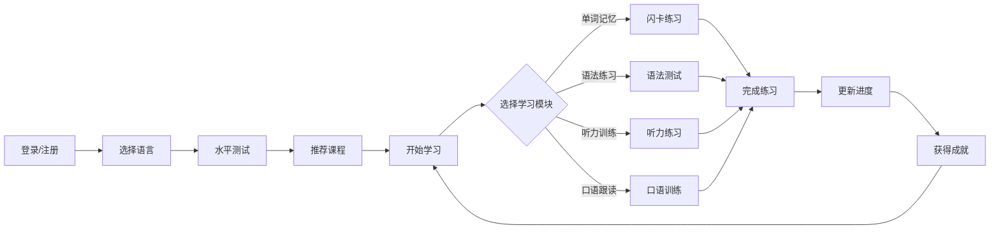

## 1. 产品概述
多语种在线教育平台，为用户提供英语、日语、韩语等主流语言的沉浸式学习体验，通过互动式学习模块和个性化推荐，帮助用户高效掌握语言技能。

### 产品目标
- 为语言学习者提供一站式学习解决方案
- 通过互动式学习提升学习效果和用户留存
- 构建学习社区，促进用户交流和共同进步

## 2. 核心功能

### 2.1 用户角色
| 角色 | 注册方式 | 核心权限 |
|------|----------|----------|
| 普通用户 | 邮箱/手机号注册 | 使用所有学习功能、社区交流、查看个人进度 |

### 2.2 功能模块
1. **首页/仪表盘**：学习概览、推荐课程、进度展示
2. **课程中心**：分级课程体系、语言选择
3. **互动学习**：单词记忆、语法练习、口语跟读、听力训练
4. **学习进度**：学习记录、成就系统、学习报告
5. **社区交流**：论坛、学习小组、经验分享
6. **用户中心**：个人信息、设置、学习偏好

### 2.3 页面详情
| 页面名称 | 模块名称 | 功能描述 |
|---------|----------|---------|
| 首页/仪表盘 | 学习概览 | 显示今日学习时长、连续学习天数、学习进度条 |
|  | 推荐课程 | 基于用户学习数据推荐个性化课程 |
|  | 快速入口 | 直接进入单词记忆、听力训练等常用功能 |
| 课程中心 | 语言选择 | 英语、日语、韩语等多语言切换 |
|  | 课程列表 | 按难度等级（入门/初级/中级/高级）展示课程 |
|  | 课程详情 | 课程介绍、学习目标、课程大纲 |
| 单词记忆 | 闪卡练习 | 正面显示单词，背面显示释义和例句 |
|  | 拼写测试 | 听音写词或看释义写词 |
|  | 进度追踪 | 已掌握/待学习单词统计 |
| 语法练习 | 选择题 | 语法知识点选择题练习 |
|  | 填空题 | 根据上下文填空 |
|  | 错题本 | 自动收集错题，便于复习 |
| 听力训练 | 短对话 | 听对话回答问题 |
|  | 长文章 | 听文章理解大意和细节 |
|  | 原文对照 | 支持显示听力原文 |
| 口语跟读 | 发音评分 | AI评分，指出发音问题 |
|  | 逐句跟读 | 逐句跟读，实时反馈 |
|  | 录音对比 | 对比自己的录音和标准发音 |
| 学习进度 | 学习日历 | 可视化显示每日学习记录 |
|  | 成就系统 | 解锁徽章、等级提升 |
|  | 学习报告 | 周/月学习报告，分析强项弱项 |
| 社区交流 | 论坛帖子 | 浏览、发布、回复帖子 |
|  | 学习小组 | 加入或创建学习小组 |
|  | 排行榜 | 学习时长、连续天数等排行 |
| 用户中心 | 个人信息 | 编辑头像、昵称、个人简介 |
|  | 学习偏好 | 设置学习目标、每日提醒 |
|  | 账号设置 | 修改密码、绑定邮箱/手机 |

## 3. 核心流程

### 用户学习流程

## 4. 用户界面设计

### 4.1 设计风格
- **主色调**：蓝色系（#3B82F6）代表知识与专业，橙色（#F97316）作为点缀色代表活力
- **按钮风格**：圆角矩形，带有轻微阴影，悬停时有缩放效果
- **字体**：使用 Noto Sans SC 作为中文字体，Inter 作为西文字体
- **布局风格**：卡片式布局，清晰的视觉层次
- **图标风格**：简洁的线性图标，来自 Lucide 图标库

### 4.2 页面设计概览
| 页面名称 | 模块名称 | UI 元素 |
|---------|----------|---------|
| 首页/仪表盘 | 学习概览 | 渐变背景卡片，数据可视化图表，动画效果 |
|  | 推荐课程 | 横向滚动卡片，卡片悬停上浮效果 |
| 课程中心 | 语言选择 | 语言国旗图标，点击切换动画 |
|  | 课程列表 | 瀑布流布局，课程难度标签 |
| 单词记忆 | 闪卡练习 | 3D翻转动画，卡片渐变背景 |
| 社区交流 | 论坛帖子 | 卡片堆叠效果，头像圆形设计 |

### 4.3 响应式设计
- 采用桌面优先设计，同时完全适配移动端
- 在小屏幕上优化为单列布局，触控友好的按钮尺寸
- 支持触摸滑动操作，如闪卡翻页、课程切换等

### 4.4 动画与交互
- 页面加载时的渐入动画
- 卡片悬停时的上浮和阴影加深效果
- 学习完成时的庆祝动画
- 进度条的平滑增长动画
